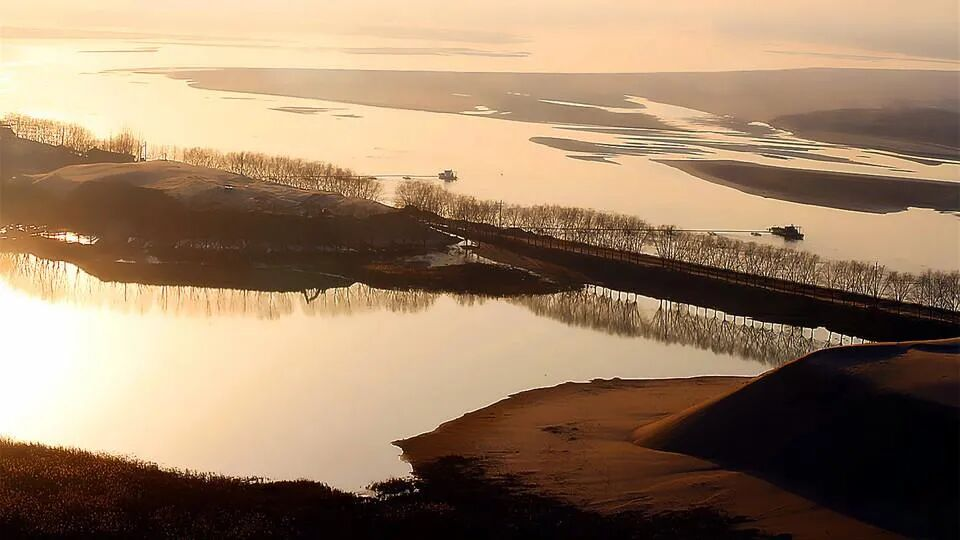

## 黄河之歌：跨越时空的交响[^1]    

**杨丹阳**

在黄河流域广袤的土地上，  
黑眼睛、黄皮肤是我们的模样，  
历史的智慧不再掩藏，  
黄河之美正如花怒放。  

那是一条流淌的金色绸带，  
从雪山之巅，到东方之海；  
它见证了人类文明的觉醒，  
它流淌在祖国大地的心脏。  

古老的黄河渡口，人们曾挥汗如雨，  
用双手和智慧，打造出生活的奇迹；  
那些被岁月深深埋藏的发展奥义，  
遥感大模型将她的面纱轻轻揭起。  

黄河啊，你是生命的源泉，  
是中华文明的摇篮！  
你的每一滴流水，都承载着希望，  
你的每一步流淌，都诉说着过往。  

我们站在新时代、新起点，  
用科技的力量，重新认识你：  
多模态的分析，让我们更懂你；  
大模型的智慧，让我们更珍惜你。  

让我们携起手，守护这片土地，  
让黄河的明天，更加美好绚丽，  
让时空的交响，永远响彻天际，  
让这黄河之歌，永远传唱不息！

[→点击此处查看我的结课论文←](./download/blog/2024-11-18-黄河史结课论文/杨丹阳 黄河史结课论文.pdf)

[^1]: 摘编自黄河史课程结课论文：《基于多模态遥感视觉大模型的黄河流域开发利用与保护研究——结合人类开发利用黄河流域的历史分析》, 武汉大学遥感信息工程学院, 杨丹阳, 2024年11月18日

