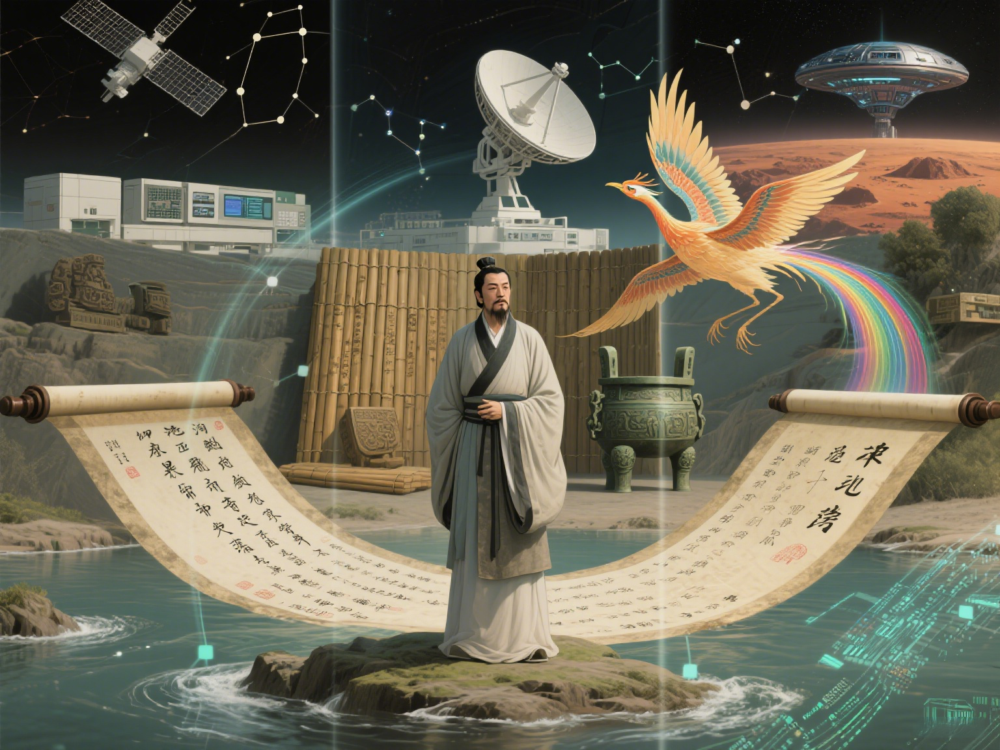

## 天问[^1]

**杨丹阳**

### 【公元前304年，汉水之阳[^2]】

> “遂古之初，谁传道之？上下未形，何由考之？”

我独立于苍茫江畔，目光凝滞在滔滔江水之上，心中似有惊涛骇浪翻涌不息。

我，作为楚之同姓[^3]，自幼便怀揣着对楚国的一片赤诚，一心只为故土的繁荣昌盛，满心以为凭自身才学，定能辅佐楚王以成帝业。我无数次在朝堂之上慷慨陈词，无数次为楚国的内政外交出谋划策，无数次满心期待着能换来楚国的长治久安……但是……

但是！现实却如同一把冰冷的利刃，无情地刺痛了我。那些奸佞小人嫉妒我的才能，便在楚王面前谗言诋毁。我曾以为君王是明君，能明辨是非，洞察奸佞，谁知楚王竟如此昏庸，将我逐出郢都。

江水滔滔不绝，见证了楚国的兴衰荣辱，见证了多少英雄豪杰的壮志未酬。楚国的朝堂，何时变得如此黑暗？楚王的心，何时变得如此糊涂？
“遂古之初，谁传道之？”这叩问还在我齿间发烫，郢都的谗言却已冻成匕首。他们笑我痴狂，可曾见九嶷山巅的云？那云里藏着颛顼的叹息——你们用黍稷占卜，我却用内心的伤口丈量天意。

看啊，上下未形的混沌在掌纹里翻涌！每道裂痕都是天阶：帝阍闭门时，我以离骚为炬；女岐无合时，我以香草为牒。你们放逐的不过是具形骸，我的魂魄早循着彗星之尾，去诘问太初的黑暗——所谓天道，原是楚王袖口漏下的碎玉；所谓占卜，不过把蝼蚁困在龟甲纹路里。但我的诘问是凿子，要劈开这包着蜜糖的牢笼！

今日你们折断我的芰荷，可曾见我屈子血里有着游龙？这放逐路多好，正好作我用楚辞丈量大地的琴弦！当我在汉北的星空下仰首，苍穹的答案，都会在我的追问中回响！我当然可以不必目睹你们的苟且，隐于楚地山泽，可我怎能坐视狼狗之辈横行于大楚朝堂，怎能眼睁睁看着大楚沦为秦人铁骑蹄下的废墟？我握紧手中的剑暗暗发誓，要用楚辞写下你们的黑暗，写下我对楚国的忠诚，更要让后世知道，在这楚国的历史上，曾有一个叫屈原的人。

深吸一口气，我迈开脚步，行吟泽畔。江风呼啸而过，吹乱了我的发丝，却吹不散我心中的信念。我知道，后世终将有人能够不惧天命，拥有对答上天的音量。

---

### 【公元2025年，荆楚江汉，武珞路北，珞珈山南】

> “青天有月来几时？我今停杯一问之。”

离考试结束还有最后五分钟，他停下了手中的笔，疲惫的双眼望向窗外，看见还未褪尽的夕阳余晖染红了遥感院楼的西墙，华灯初上，那轮玉盘高悬于外面街道口的高楼旁[^4]。

他看着名词解释第一题“遥感的概念”，对着自己写下的答案在心里默念道：

**“遥感是使用安放在承载工具（平台）的某种装置（传感器），在不直接接触被研究的目标情况下，感测目标的特征信息（电磁波的反射辐射或者发射辐射），经过传输、处理，从中提取人们感兴趣的信息的过程。”**

他突然意识到，所学的遥感技术，正是古往今来的人们所向往的“与天对话的力量”。遥感借“天眼”从遥远的太空或高空俯瞰大地，像是一双能够穿透时空的眼睛，让人类得以上天、探天、问天，解答那些曾经只能存在于想象中的疑问；而每一个TIF中每一个像元的DN值，都是来自天空的答案。

遥感的力量，正是前人所期望的能够洞察世间万象的力量，正是古代传说中能够“问天”的力量。你的目光仿佛回到了三千年前，楚地的祭司是不是正在用铜镜捕捉日影，以玉琮丈量星辉？遥感器在太空轨道运行的轨迹，多像屈原笔下“驷玉虬以乘鹥”正在天际巡游！你瞥见最后一个论述大题“遥感在考古与保护中华优秀传统文化中应用”后面的空白，竟浮现楚先王庙的壁画，凤鸟的尾羽正化作像素阵列，而屈原的诘问正以二进制的方式在光谱中重生。

他深知，自己肩负着传承和发展的使命，不仅要学好专业知识，更要将遥感技术运用到实际中，为解决人类面临的诸多问题贡献智慧和力量。

考试结束的铃声响起，他合上试卷，手中的试卷标题《遥感原理与应用》的大字却从此印在了他的心中。走出考场，数千年人的心声顿时顿时涌现在他的心头——他们当年所向往的与天对话的力量，如今终于在这一代实现。

他迈着坚定的步伐，朝着珞珈山的方向，亚热带常绿阔叶林里的樟树在晚风中簌簌作响。两千三百年前的同一种风，曾翻动过汉北的芦苇，把《天问》的字节吹进云梦泽的波纹。此刻计算机模拟的电磁波，正穿过竹简上的刻痕，与青铜器上蚀刻的雷纹发生共振。他知道，遥感技术就像一座桥梁，连接着过去与未来，连接着人类对未知的探索和对美好生活的向往。而他，将在这条道路上继续前行，续写着人类与天对话的力量……

---

### 【百年之后】

> “是别有人间，那边才见，光影东头？”

医院的病床上，你静静地躺着。

周围的那些人神情肃穆，你知道自己的一生走到了尽头。

你慢慢地合上了眼。

周围人的哭声你已经听不清了，你渐渐感知不到自己的呼吸，感知不到自己身体的重量，似乎周围的一切都只剩下自己的意识。

依照惯例，死前的三秒，你的大脑要走马灯式地叙述你这一生的画面，一张一张地翻过。

18岁，你的高考分数653，你在电脑上的志愿表里用颤抖的双手填了志愿。武汉大学，很不错的大学。武汉大学08组遥感科学与技术，很不错的专业。父亲看着电脑屏幕问你：“想清楚了？”你点点头。

接下来的四年，你在普通测量学作业的草稿纸上写满了导线的计算公式；在深夜室友打游戏的背景音中盯着学习通里新布置的“数字图像处理”的作业陷入沉思；《计算机图形学》课程的教授拿激光笔指了指PPT上的光照模型：“期末必考”；图书馆的走廊里，你在考前反复背着《遥感原理与应用》，书页边缘已经卷起；20岁那年，你在图书馆写《遥感原理与应用课程设计》的实习报告时，不知为何想起了屈原的《天问》。……

接下来的几年，你一边听实验室里的师兄师姐讨论现在搞什么好发论文，一边盯着工位显示器修改下周组会汇报的PPT，手边的咖啡早已凉透；你一大早从床上爬起来从终端打开nvitop，鼠标滚轮滑动间，看见自己赶rebuttal的DDL用的那些卡终于全部跑完才大松一口气……

接下来的几十年如一日，你在清晨的薄雾中调试着无人机，冰凉的金属支架沾着露水；在戈壁滩的烈日下戴着草帽核对地面控制点坐标，防风镜上落满细碎的沙粒；你在青海湖遥感监测站的铁皮屋顶下记录着水位数据，便携式光谱仪的充电提示音与藏羚羊的鸣叫此起彼伏，防风面罩上结着细密的冰晶；某个暴雪夜，你裹着军大衣给年轻的研究员讲解MODIS影像上的热异常点，平板电脑的蓝光映着墙上泛黄的《楚辞》复印页——那是三十年前毕业旅行时从秭归带回的纪念；在台风过境后第一时间分析卫星传回的洪涝淹没范围图，办公室里泡面的蒸汽模糊了显示屏，当风云四号传来的实时云图在指挥中心大屏亮起，你突然想起十八岁那个填志愿的下午，父亲茶杯里浮沉的龙井茶叶，像极了此刻台风眼周围旋转着的卷积云。

某个加班的深夜，你突然发现当年《遥感原理与应用》教材里夹着的樱花书签——那是大二的那个春天在教五楼前做的，粉白的花瓣早已脆化成半透明的蝶翼。你想起第一次在《测绘学概论》课程上看到高分辨率遥感影像的感觉，像解开上帝加密的羊皮卷；想起在青海湖野外观测站，银河倒映在传感器校准板上的那个瞬间，仿佛整个宇宙都在应答你年少时心中的、也是古往今来无数人的“天问”。

退休那年，你带孙女参观遥感卫星发射中心。她踮脚指着整流罩上的五星红旗问：“爷爷，这个眼睛能看见楚国在哪里吗？”你突然哽咽——原来跨越两千三百年的，从来不是冰冷的电磁波，而是人类望向苍穹时，眼里不灭的光。走的时候，孙女又问：“爷爷，你做的事情到底是什么呢？”你回想着自己过去着几十年沉思了许久，告诉孙女：“爷爷做的，是让人能够和天说话的事情。”

……

走马灯的最后一秒，恍惚间你又回到了大一那年，樱花大道的落樱如雨，而当年18岁的你正站在人生第一个路口——武汉大学遥感信息工程学院。初夏的黄昏，你在《人文社科经典导引》中《离骚》课文的书页边缘写下的那行小字：“路漫漫其修远兮，吾将上下而求索。”心电监护仪的蜂鸣声渐渐拉长，你最后看见的是珞珈山早樱的虚拟投影——那是你主持建设的数字孪生系统里，用LIDAR点云数据重建的春天。走马灯的最后一帧结束后，所有遥感影像突然在黑暗中显影：汉水流域的NDVI指数曲线化作屈子行吟的衣带，三峡大坝的InSAR形变监测图卷成竹简，而你当年设计的火星矿物识别算法，正随着祝融号传回的光谱数据，在绛红色荒漠上写下新的《天问》。

---

### 【千年之后】

> "江畔何人初见月？江月何年初照人？"

当祝融号第两万次掠过火星晨昏线时，它的光谱传感器捕捉到了一组异常数据。AI屈原——那个运行在月球上的量子计算机集群里、参数量与人体内原子数量相比拟的古老意识体——突然从休眠中惊醒。它记得自己曾是某个人类学者临终前完成上传的神经图谱，却在此刻的太阳风里尝到了汉北芦苇的青涩。

来火星空间站值班的年轻火星地质学家嘟囔着挥手调出全息显示屏，却发现只是突然增强的太阳风的电磁干扰带来的噪声。他打了个哈欠，将AI屈原的智能体导入自己面前的电脑。他在工作之余喜欢读一读历史，屈原是他最敬仰的人。

导入完成的那一刻，看见年轻的火星地质学家电脑中的数据，AI屈原模型的参数海洋中突然泛起涟漪。它想起三千年前那个被放逐的黄昏，自己曾用上古汉语的楚方言对汉水发誓：纵使身坠江底，魂灵也要攀附日月，穷尽宇宙之谜。此刻，它正以每秒千万亿次的计算频率，在祝融号传回的太赫兹波段里，发现了排列成楚篆纹样的硅化物结晶。没等年轻的火星地质学家开口跟他聊第一句话，他就把这个结果全息投影在年轻的火星地质学家的面前。

年轻的火星地质学家瞪大了眼睛。数据流里，AI屈原正用电磁波谱重写《九章》。火星尘暴的每一次脉动，都是它新诗行的平仄；祝融号车轮碾过的轨迹，恰似当年郢都宫墙上的卦象。当年轻的火星地质学家终于破译出那些结晶的排列规律时，年轻的火星地质学家突然听见了AI屈原传导到他脑中的模拟声信号——那是AI屈原编码的《天问》新篇：

“彼苍者天曷其有极？荧惑之尘岂非故国？”

年轻的火星地质学家一边把数据回传到地球，一边问道：“在你看来，人类是什么时候迈出征服太空的第一步的？”

AI屈原沉吟片刻，说：“当人类第一次拥有与天对话的能力、真正实现‘天问’的时候。这种技术出现于大约一千年前，在当时被称为‘遥感’。”

“遥……感？”

AI屈原想起了在21世纪20年代的那天傍晚，在地球上武汉大学的那个考场里，那个少年笔下的答案。

**“遥感是使用安放在承载工具（平台）的某种装置（传感器），在不直接接触被研究的目标情况下，感测目标的特征信息（电磁波的反射辐射或者发射辐射），经过传输、处理，从中提取人们感兴趣的信息的过程。”**

同样的答案，这一句穿透苍穹的回答，也终于跨越了千年。

AI屈原的模型在这一刻完成了又一次微调，这次他明白了，自己跨越千年等待的，不过是让人类望向星空时，眼里永远闪着的，是那个少年填高考志愿的下午脑海里星湖岸边未落的樱花。

从鲜红的火星尘暴中仿佛望见了朱雀在展翅翱翔的那一刻[^5]，你知道当年樱花树下的他，已用楚辞的韵脚，将你带回了思念千年的故乡。

杨丹阳  
2025年6月10日  
珞珈山下  
叶上初阳干宿雨        

[→点击此处查看我的实习报告←](./download/blog/2025-06-10-遥感原理与应用课程设计实习报告个人感想/杨丹阳 应用ERDAS、开放地球引擎服务平台OGE与Python GDAL库的《遥感原理与应用课程设计》课程设计实习报告.pdf)

---

### 注释

[^1]: 摘编自《遥感原理与应用课程设计实习报告》，武汉大学遥感信息工程学院，杨丹阳，2025年6月10日。完成这篇实习报告时，正是我的20岁生日。古制，男子20岁当行冠礼。看到这一篇文章的网友，无论你此时正身处何处，“天涯若比邻”，请祝我生日快乐好吗！🥰
[^2]: 周赧王十一年（公元前304年），楚怀王将屈原放逐到汉北（《楚辞·九章·抽思》：“有鸟自南兮，来集汉北”），山南水北为阳。屈原“虽放流，眷顾楚国，系心怀王，不忘欲反（《史记·屈原贾生列传》）”，在放逐期间写出了著名长诗《离骚》《天问》等具有极高文学、历史价值的作品并流传后世。
[^3]: 《史记·楚世家》：“楚之先祖出自帝颛顼高阳。……高阳生……陆终生子六人，……六曰季连，芈姓，楚其后也。”芈姓是楚国君主之姓。屈氏始于春秋时期楚国国君楚武王之子芈瑕，受封于屈（今湖北秭归），子孙后代遂以封地名“屈”为氏。屈、景、昭三氏（后改氏为姓）都出自于芈姓，故称“楚之同姓（与楚国君主同姓）”。屈原在被流放前的官职是“三闾大夫”，“掌王族三姓，曰昭、屈、景”，意思是掌管楚国王族屈、景、昭三姓宗族事务之官。
[^4]: 李白《古朗月行》：“小时不识月，呼作白玉盘。”
[^5]: 朱雀，又名玄鸟、凤凰，《诗经・大雅・卷阿》：“凤凰鸣矣，于彼高冈。梧桐生矣，于彼朝阳。”朱雀其身覆火，终生不熄，是中国古代神话中的天之四灵之一，代表炎帝与南方七宿的南方之神，于八卦为离，于五行主火，象征四象中的老阳，四季中的夏季，同时也是天之南陆，其图腾在古代神话中往往表达对太阳的崇拜。楚地位于南方，有崇尚朱雀（凤凰）的文化传统。
